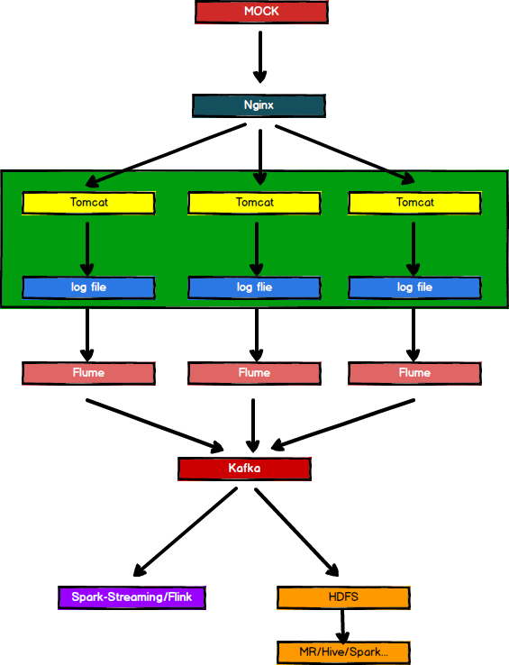

imooc日志信息实时分析




## 1 环境准备

### 1.1 nginx

CentOS 修改最大打开文件数和进程数

修改`/etc/security/limits.conf`文件，文件尾部增加以下配置

```
* soft nofile 65535
* hard nofile 65535
* soft nproc  65535
* hard nproc  65535
* soft core   unlimited
* hard core   unlimited
```

重启服务器后，再通过`ulimit -n`查看是否生效


nginx配置

```
worker_processes  2;                                                                                                           3 worker_rlimit_nofile 65535;

events {
    worker_connections  65535;
}
http {
    upstream logserver{
        server   hadoop102:8082  weight=1;
        server   hadoop103:8082  weight=1;
        server   hadoop104:8082  weight=1;
}
    include       mime.types;
    default_type  application/octet-stream;
    sendfile        on;
    #tcp_nopush     on;
    #keepalive_timeout  0;
    keepalive_timeout  65;
    #gzip  on;

    server {
        listen       80;
        server_name  logserver;
        #charset koi8-r;
        #access_log  logs/host.access.log  main;
        location / {
            root   html;
            index  index.html index.htm;
            proxy_pass http://logserver;
            proxy_connect_timeout 10;
        }
        #error_page  404              /404.html;
        # redirect server error pages to the static page /50x.html
        #
        error_page   500 502 503 504  /50x.html;
        location = /50x.html {
            root   html;
        }
    }
}

```


Flume-kafka.conf

```
# define
a1.sources = r1
a1.sinks = k1

a1.channels = c1
# source
a1.sources.r1.type = exec
a1.sources.r1.command = tail -F -c +0 /home/zzy/imooclog/log/app.log
a1.sources.r1.shell = /bin/bash -c
# sink
a1.sinks.k1.type = org.apache.flume.sink.kafka.KafkaSink
a1.sinks.k1.kafka.bootstrap.servers = hadoop102:9092,hadoop103:9092,hadoop104:9092
a1.sinks.k1.kafka.topic = imooc
a1.sinks.k1.kafka.flumeBatchSize = 20
a1.sinks.k1.kafka.producer.acks = 1
a1.sinks.k1.kafka.producer.linger.ms = 1
# channel
a1.channels.c1.type = memory
a1.channels.c1.capacity = 1000
a1.channels.c1.transactionCapacity = 100
# bind
a1.sources.r1.channels = c1
a1.sinks.k1.channel = c1
```

Flume启动命令

```
bin/flume-ng agent --conf conf/ --name a1 --conf-file job/flume-kafka.conf -Dflume.root.logger=INFO,console
```

