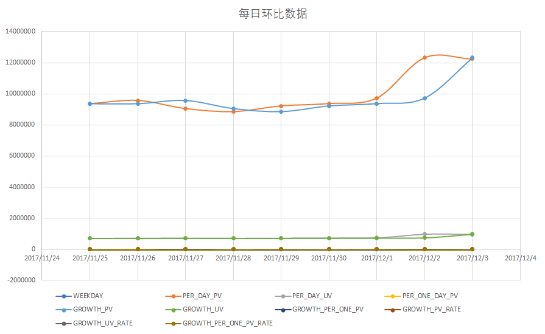
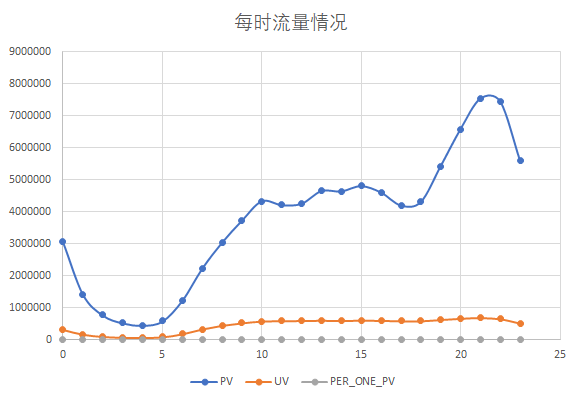

# User Behavior Data from Taobao for Recommendation


集器环境：

hadoop 3.2.0

zookeeper 3.6.3

spark 3.0.0

zeppelin 0.10.0

三台Vmware centos7组成的hadoop集群，spark运行模式为yarn client，代码执行在zeppelin端，并使用其作为可视化工具


## 1 数据处理

### 1.1 数据来源

数据来自阿里天池：[User Behavior Data from Taobao](https://tianchi.aliyun.com/dataset/dataDetail?dataId=649)，数据集包含了2017年11月25日至2017年12月3日之间，有行为的约一百万随机用户的所有行为（行为包括点击、购买、加购、喜欢）。数据集的每一行表示一条用户行为，由用户ID、商品ID、商品类目ID、行为类型和时间戳组成，并以逗号分隔。

| 列名称     | 说明                                               |
| :--------- | :------------------------------------------------- |
| 用户ID     | 整数类型，序列化后的用户ID                         |
| 商品ID     | 整数类型，序列化后的商品ID                         |
| 商品类目ID | 整数类型，序列化后的商品所属类目ID                 |
| 行为类型   | 字符串，枚举类型，包括('pv', 'buy', 'cart', 'fav') |
| 时间戳     | 行为发生的时间戳                                   |

用户行为类型共有四种：

| 行为类型 | 说明                     |
| :------- | :----------------------- |
| pv       | 商品详情页pv，等价于点击 |
| buy      | 商品购买                 |
| cart     | 将商品加入购物车         |
| fav      | 收藏商品                 |

数据集大小说明：

| 维度         | 数量        |
| :----------- | :---------- |
| 用户数量     | 987,994     |
| 商品数量     | 4,162,024   |
| 用户数量     | 987,994     |
| 商品类目数量 | 9,439       |
| 所有行为数量 | 100,150,807 |


### 1.2 数据清洗

```scala
//加载数据
val df = spark.
        read.
        option("inferSchema", "true").
        csv("hdfs://hadoop102:8020/analysis/UserBehavior.csv")
        
//格式化表头
val data=df.toDF("userid","itemid","cateid","behavior","timestamp")

//查看数据的基本统计信息
println(data.describe())
```

```
+-------+------------------+------------------+------------------+---------+--------------------+
|summary|            userid|            itemid|            cateid| behavior|           timestamp|
+-------+------------------+------------------+------------------+---------+--------------------+
|  count|         100150807|         100150807|         100150807|100150807|           100150807|
|   mean|506943.12166863517|2579774.7998742834|  2696380.39171917|     null|1.5119512768722115E9|
| stddev| 294060.5026583998|1488055.9874815156|1463154.5235416417|     null|   5528006.068990403|
|    min|                 1|                 1|                80|      buy|         -2134949234|
|    max|           1018011|           5163070|           5162429|       pv|          2122867355|
+-------+------------------+------------------+------------------+---------+--------------------+
```

>可以看出，数据没有缺失值
>
>


```scala
//添加日期、小时列
val parsed = data.withColumn("date",from_unixtime(col("timestamp"),"yyyy-MM-dd")).
            withColumn("hour",from_unixtime(col("timestamp"),"HH"))
            
//删除时间不在2017年11月25日至2017年12月3日之间的值
val datadf = parsed.filter((col("date")>"2017-11-24").and((col("date") < "2017-12-04")))

//创建本地临时视图，之后使用sql分析数据
datadf.createOrReplaceTempView("user")
```


## 2 构建模型与数据分析

### 2.1 用户活跃度分析

主要根据流量指标：流量PV、访客数UV、人均浏览量PV/UV来对用户活跃情况进行量化分析，分别从整体到局部进行分析，找出用户活跃规律

#### 2.1.1 整体流量情况

```sql
%spark.sql

select 
sum(if(behavior='pv',1,0)) as PV,
count(distinct userid) as UV,
sum(if(behavior='pv',1,0))/count(distinct userid) as PER_PV
from user;
```

| PV       | UV     | PER_PV            |
| -------- | ------ | ----------------- |
| 89660688 | 987991 | 90.75051088522062 |

>PV :流量PV
>
>UV:访客数
>
>PER_PV：人均浏览量


#### 2.1.2 每日浏览量

```sql
%spark.sql

select `date`,
sum(if(behavior='pv',1,0)) as PER_PV,
count(distinct userid) as PER_UV,
sum(if(behavior='pv',1,0))/count(distinct userid) as PER_ONE_PER_DAY_PV
from user
group by `date`
order by `date`;
```


环比数据

```sql
%spark.sql

--环比数据
WITH T1 AS (
    SELECT
        date AS date,
        WEEKDAY( date ) WEEKDAY,
        sum(IF( behavior = 'pv', 1, 0 )) AS PER_DAY_PV,
        count( DISTINCT userid ) AS PER_DAY_UV,
        sum(IF( behavior = 'pv', 1, 0 ))/ count( DISTINCT userid ) AS PER_ONE_DAY_PV 
        FROM user
        GROUP BY date
    ),
T2 as   (SELECT
    *,
    lag(PER_DAY_PV, 1,PER_DAY_PV ) over ( ORDER BY date ) GROWTH_PV,
    lag(PER_DAY_UV, 1,PER_DAY_UV ) over ( ORDER BY date ) GROWTH_UV,
    lag(PER_ONE_DAY_PV,1,PER_ONE_DAY_PV) over ( ORDER BY date ) GROWTH_PER_ONE_PV 
FROM T1)
select *,
(PER_DAY_PV-GROWTH_PV)/GROWTH_PV *100 GROWTH_PV_RATE,
(PER_DAY_UV-GROWTH_UV)/GROWTH_UV *100 GROWTH_UV_RATE,
(PER_ONE_DAY_PV-GROWTH_PER_ONE_PV)/GROWTH_PER_ONE_PV *100 GROWTH_PER_ONE_PV_RATE
FROM  T2

```




>图表展示可以发现，浏览量PV和访客数UV的变化总体趋势是相同的，工作日比较平稳，周末会有小幅上升

#### 2.1.3 每时刻流量情况

```sql
%spark.sql

--每时刻流量情况：浏览量PV，访客数UV，人均浏览量
select hour as hour,
sum(if(behavior='pv',1,0)) as PV,
count(distinct userid) as UV,
sum(if(behavior='pv',1,0))/count(distinct userid) as PER_ONE_PV
from user
group by hour;
```




>晚上（18时）浏览量开始激增，在（21-22时）达到顶峰，是用户最活跃的时刻。商家应该集中资源，重点在晚上（18-23时）进行引流与营销活动。


### 2.2 用户留存分析

>主要采用群组分析法
>
>对从11月25日开始到12月3日期间用户的新增与留存情况进行分析。首日（11月25日）的新用户定义为当天所有存在任意行为记录的用户，其余日期的新用户则定义为在此之前未出现过任何行为记录，而当天存在任意行为记录的用户

```sql
%spark.sql
--创建视图

create temp view v_remain_time as
SELECT
    userid,
    date,
    min( date ) over ( PARTITION BY userid ORDER BY date )  firstday
FROM
    user 
GROUP BY
    userid,
    date;
```


```sql
%spark.sql
--  获取第一次时间时间和后续使用时间的间隔jg_day
create temp view v_remain_interval as 
select userid ,date,firstday,datediff(date,firstday) as interval_day
from v_remain_time;

%spark.sql

-- 计算留存日的用户数量 count,sum皆可
create temp view v_cus_quan as
select firstday,
-- count(case WHEN interval_day=0 then 1 end),
sum(case when interval_day=0 then 1 else 0 end) as day_0,
sum(case when interval_day=1 then 1 else 0 end) as day_1,
sum(case when interval_day=2 then 1 else 0 end) as day_2,
sum(case when interval_day=3 then 1 else 0 end) as day_3,
sum(case when interval_day=4 then 1 else 0 end) as day_4,
sum(case when interval_day=5 then 1 else 0 end) as day_5,
sum(case when interval_day=6 then 1 else 0 end) as day_6,
sum(case when interval_day=7 then 1 else 0 end) as day_7,
sum(case when interval_day=8 then 1 else 0 end) as day_8
from v_remain_interval
group by firstday
order by firstday;

%spark.sql
--计算留存率
select firstday,day_0 new_user ,
concat(round(day_1/day_0,3)*100,'%') as keep_1,
concat(round(day_2/day_0,3)*100,'%') as keep_2,
concat(round(day_3/day_0,3)*100,'%') as keep_3,
concat(round(day_4/day_0,3)*100,'%') as keep_4,
concat(round(day_5/day_0,3)*100,'%') as keep_5,
concat(round(day_6/day_0,3)*100,'%') as keep_6,
concat(round(day_7/day_0,3)*100,'%') as keep_7,
concat(round(day_8/day_0,3)*100,'%') as keep_8
from v_cus_quan;
```


| firstday   | new_user | keep_1 | keep_2 | keep_3 | keep_4 | keep_5 | keep_6 | keep_7 | keep_8 |
| ---------- | -------- | ------ | ------ | ------ | ------ | ------ | ------ | ------ | ------ |
| 2017/11/25 | 706641   | 78.90% | 76.80% | 75.90% | 76.10% | 76.60% | 77.30% | 98.60% | 98.30% |
| 2017/11/26 | 158188   | 65.40% | 64.60% | 65.90% | 66.90% | 68.60% | 97.80% | 97.40% | 0.00%  |
| 2017/11/27 | 63825    | 61.50% | 62.40% | 64.40% | 66.30% | 97.20% | 96.70% | 0.00%  | 0.00%  |
| 2017/11/28 | 31331    | 61.80% | 63.70% | 66.40% | 96.80% | 96.20% | 0.00%  | 0.00%  | 0.00%  |
| 2017/11/29 | 17931    | 69.80% | 72.00% | 96.60% | 96.00% | 0.00%  | 0.00%  | 0.00%  | 0.00%  |
| 2017/11/30 | 9801     | 94.60% | 95.80% | 95.30% | 0.00%  | 0.00%  | 0.00%  | 0.00%  | 0.00%  |
| 2017/12/1  | 255      | 90.20% | 92.90% | 0.00%  | 0.00%  | 0.00%  | 0.00%  | 0.00%  | 0.00%  |
| 2017/12/2  | 18       | 72.20% | 0.00%  | 0.00%  | 0.00%  | 0.00%  | 0.00%  | 0.00%  | 0.00%  |
| 2017/12/3  | 1        | 0.00%  | 0.00%  | 0.00%  | 0.00%  | 0.00%  | 0.00%  | 0.00%  | 0.00%  |


>每日新增用户数呈下降的趋势，但是留存率几乎都保持在60%以上，且均在12月2日和3日迎来留存高峰，符合前面查证的双十二预热与焕新活动带来的用户关注度。


### 2.3 用户购买情况分析

#### 2.3.1 复购率

>主要从用户复购率角度进行分析

```sql
%spark.sql

-- 创建复购率视图，每位用户的购买次数
create temp view re_purchase  as 
select distinct userid,count(behavior) as frequency
from user
where behavior='buy'
group by userid
having count(behavior)>=2
order by frequency desc;
-- 计算复购率
select 
(select count(1) from re_purchase )/
(select count(distinct userid) from user where behavior='buy') re_rate;
```

>结果为0.6601061266738449
>
>用户质量挺高

#### 2.3.2 复购次数频数

```sql
%spark.sql
-- 不同购买次数的人数分布
select frequency,count(userid) as user_num
from re_purchase
group by frequency
order by frequency desc;
```


